# Безупречный путь

### Верность пасьянсу Медичи

Для тех кого посадили в СИЗО мир даёт время чтобы разобрать бритвенный станок и повырезать лезвием красивые игральные карты из коробки чокопая. Но к сожалению одним укладом, находясь на шахматной доске, где тобой ежедневно двигает следователь и адвокат, не обойтись.

Я пересоздал метод получения желанного с помощью которого запорол сизошную засаду, прошёл мимо маньяков и не дал себя запугать судным днём.

Я нашёл верный метод который переделал пыточную в мой дом, у которого уже не было никакого резона избавляться от меня.

Добро и вам пожаловать в новый Пасьянс Медичи четырёх мастей!

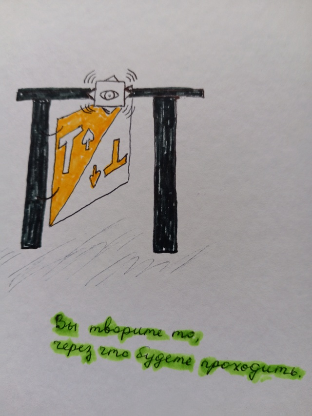

<hr>

### ♡Источники улучшения Кастанеды♡

Непреодолимая сила и мощь в нашем мире представлена в виде стихий. В игральных картах это масти, где:

```
♡ - олицетворяет стихию воды
♤ - воздух
♧ - землю
♢ - огонь
```

Стихии могут как разрушать города, так и вскипятить чайник, в зависимости от уровней изъятия. В игральных картах это номиналы, где:

```
2 - второй уровень
10 - десятый
В - одиннадцатый
Т - четырнадцатый
```

Чем больше уровень изъятия стихии, тем адекватней социум вашего города и быстрее ближайшая местность вашего города может для вас сменить реальность.

При сбое какого то уровня - большие уровни тоже могут сбоить или прекратить свою работу. Защита от сбоев была придумана в виде режимов обогащения:

```
1. лаконичное - 46-100% защиты
2. фанатическое - 36-45%
3. изысканное - 21-35%
4. эстетичное - 11-20%
5. паханское 1-10%
6. изящное - 0% как реконструкция
7. отзывчивое - отрицательный % самопожертвования
```

Обычно режимы обогащения завязаны на возрастной период нашего тела:

```
0-4 лет - отзывчивость
5-6 - изящество
7-15 - паханство
16-25 - эстетика
26-28 - изысканность
29-30 - фанатизм
от 31 - лаконичность
```

Ритмы жизни при обогащении примерно такие:

```
Отзывчивость (пародия на Дискотеку аварию)

Смех-смех, как это мило
Смех-смех по причине
Особые гости у нас для вас
Развеселят вашу обстановку в раз

А когда вам на самом деле станет веселее
Если вы конечно не будете заняты другим
Вы целым цехом вздрогнете у себя там мигом
И позовёте сделать всё вот это нас на бис:

Смех-смех, как это мило
Смех-смех вы уж простите
И вот мы уже закончили наш рассказ
Чтобы разойтись нам с миром в раз
```

```
Изящество (пародия на Эдиту Пьеху)

Он хотел сбежать от меня
Он мальчишка ещё вроде
Наказать хотела я
А оказалась в его засаде

Сделал так что захотела я
То чего ещё на знала
По простому говоря
Я во всю в него запала

Там-там где не цвели ещё поля
Был он самым нежным и желанным
Там-там, где я хотела наказать
Оказался список удивительных желаний
```

```
Паханство (пародия на Муслима Магомаева)

Томная ночь
Ты лежишь напротив меня
Глубоко погружёна в себя
Обо мне ты мечтаешь

Томная ночь
Там где плохо уже нет там тебя
Знаешь меня нет тоже там
Так бывает

Томная ночь
Где рассвет нас встречает теплом
Чтобы согреть нас завтрашним днём
И ничего не раздражает
```

```
Эстетика (пародия на Ва Банкъ)

Власть! Я хочу Познать Власть!
Чтобы у кого нибудь отнять
То что никогда не принадлежало мне
Без какого нибудь разрешения

Власть! Я хочу Понять Власть!
Которая хочет изъять меня
Из моего же государства
За заработанные мной деньги

Власть! Кто из нас Власть
Когда нет у нас жены
Которая хотела бы выйти замуж
Чтобы поуправлять другими всласть
```

```
Изысканность (пародия на Уматурман)

Есть Антон Городецкий
Как то он зашёл в город соседский
Упырей мочить, зомбаков притеснять

Но случилась загвоздка
Встретил Настю Каменскую
Волкодава в погонах чтобы ему помешать

И началась  разбериха
Кто чей сын и чья дочь на районе
Имеют право вырвать волосы вклочь

Всё случилось бы плохо
Если не другая загвоздка
В такой суете потеряли они ключ

И не ели и не спали
Всё искали и искали
Зачем они встретились и почему
```

```
Фанатизм (пародия на Грибы)

Между нами превосходство
И никто нас не поймёт
Почему мы раньше не могли
Выйти из своего глупого одиночества

Но настанет новый день
Мы поймём куда идти
Чтобы навсегда нам позабыть
Как не нужны были друг другу

Соберём мы деньги дружно
И уедем навсегда
Там где всё это не нужно
Чтобы не пытались отобрать

А когда настанет скука
Позовём других друзей
Позабавимся мы с ними
И застелсимся от них
```

```
Лаконичность (пародия на Лакосту)

Будем делать новый мир
Как строитель кладёт кирпич
Так и мы найдём основу
Срастить которую сможем мы

И когда удивит свет
Что случилось у нас с тобой
Увековечат нас вовек
Как творцов небесной глади

И потери все уйдут
В пропасть тайною дорогой
Чтобы не вспомнили про нас
Ничего плохого в небе
```

У каждого режима обогащения разные назначения стихий:

```
Отзывчивость

♡ - осмотрительность
♤ - осмысленность
♧ - познавательность
♢ - энтузиазм
```

```
Изящество

♡ - сюрреализм
♤ - парадоксальность
♧ - невинность
♢ - замечательность
```

```
Паханство

♡ - поощрение
♤ - рассудительность
♧ - кокетство
♢ - аргументирование
```

```
Эстетика

♡ - осторожность
♤ - безжалостность
♧ - устроенность
♢ - занимательность
```

```
Изысканность

♡ - подсматривание
♤ - параноидальность
♧ - результативность
♢ - манипулирование
```

```
Фанатство

♡ - впечатление
♤ - отстаивание
♧ - привлекательность
♢ - одобрение
```

```
Лаконичность

♡ - искренность
♤ - победоносность
♧ - дружелюбие
♢ - внимательность
```

Названия стихий подбирались по такой формуле:

```
Счастье

♡ - залипание
♤ - комфорт
♧ - уют
♢ - обожание
```
При этом, ♡ + ♤ = ☯ милота, ♢ + ♧ = ☢ единство.

<hr>

### ♤Резонанс тенденций Зеланда♤

Наше время переменчиво и гарантом перемен является Год (может себе позволить).

У года есть четыре сезона, которые представляют сферы влияния. Назначения сфер влияний такие: 


```
весна - стратегия
лето - восхищение
осень - вдохновение
зима - прорицание
```

Вы наверно слышали выражение как "ветер перемен", в нашем же случае это надо понимать как "стратегию перемен".

У сезонов по три месяца, где каждый из них завязан на определенный вид деятельности, где их направления такие:

```
март - Т - расположение
апрель - К - позиционирование
май - Д - маскировка
июнь - В - блаженство
июль - 10 - озарение
август - 9 - посредственность
сентябрь - 8 - рациональность
октябрь - 7 - чистка
ноябрь - 6 - уединение
декабрь - 5 - прагматичность
январь - 4 - привязанность
февраль - 3 - выгода
март - 2 - празднование
```

Здесь Т и 2-ка смежные уровни, которые запитаны друг на друга в виде марта, как причина реальной смены старого года на новый. Возможно восьмого.

Особой фишкой новой методики будет ступенчатая переправа по сезонам года, где мы сможем воспользоваться другим месяцем не дожидаясь их по календарю.

Не мы служим месяцам, а они нам.

Ступенчатой переправой будет использование трёх социализирующих позиций:

```
1) з - запрос
2) п - предложение
3) р - реализация
```

Схема переправы такая: 

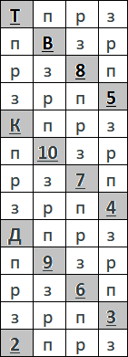

В этой схеме переправу делаем по <b>п-р-з</b> и <b>з-р-п</b>, где прз это предложение реализованному запросу, а зрп это запрос реализованному предложению.

Переправы будут образовывать часть цепочки событий пасьянса Медичи, только ваша часть будет работать на вас (вашему желанию).

Чтобы на переправах полностью исключить диссонансы нужно уравновесить количество использованных направлений на укладе. Например  (прз (1) = зрп (1)):

<b>Т → прз → К → зрп → 5</b>

Или чуть больше переправ (прз (2) = зрп (2)):

<b>8 → прз → В → прз → К → зрп → 10 → зрп → 9</b>

Черед использования переправ не важен, нужно их равнозначное количество по итогу.

Новый уклад начинаем с последней карты предыдущего уклада. При этом переправа должна переходить на другой номинал карты. И одинаковых карты (номинал + масть) в новом укладе тоже исключаем.

Масти карт при переправах такие:

```
♡ - прз для женщины
♤ - зрп для мужчины
♧ - зрп для женщины
♢ - прз для мужчины
```

Например для мужчины:

<b>Т♢ → прз  → К♢→ зрп → 5♤</b>

Или кратче:

<b>Т♢ → К♢→ 5♤</b>

Где новый уклад:

<b>К♢→ 5♤</b>

Номиналы Т и 2-ку можно взаимозаменять. Например:

<b>Т♢ (считаем как 2) → Д♤→ 10♢</b>

<hr>

### ♢Семейность игры Престолов♢

Ключи к уровням изъятия обогащения такие:

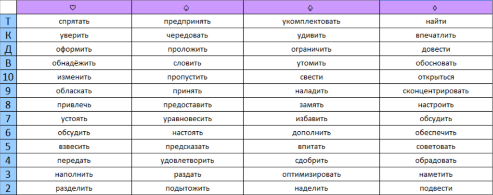

Чтобы определить к какой игральной карте принадлежит ваше желание нужно пройтись по такой схеме отбора:

1) чья сфера влияния
2) чьё направление влияния
3) это нужда (зрп) или нужно внедрить (прз)

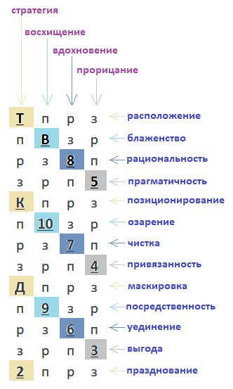

Переправу от одного номинала карты к другому нужно закреплять мантрами:

```
Я озадачиваю свой Безупречный Путь
{каким: таким то режимом обогащения по масти}
{чем: ключом к уровню обогащения таким то}
чтобы
{что то, что я желаю}
```

Например для 4♢ (лаконичность):

<b>Я озадачиваю свой Безупречный Путь внимательным обрадованием чтобы меня освободили от тюрьмы и дурки.</b>

По началу нужно проработать себя изначальными мантрами "я желаю всем моего комфорта и моего обожания" (для мужчин, это восстановит денежный поток) и "я желаю всем моего залипания и моего уюта" (для женщин, чтобы дом-квартира была и там было тепло).

Мантры нужно проговаривать (или про себя) до состояния эмпатии, когда "увидите" чёткий образ действий без сопротивления. В дальнейшем этот образ (проекция) реализуется сама собой посредством вас или кого то, если конечно никто не воспрепятствует, но это вы заметите.

Применяя ключи нужно закрепиться за режимом обогащения для лучшей вашей самоотдачи:

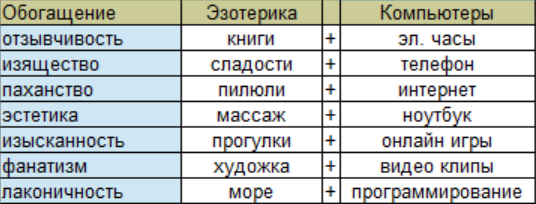

Чтобы заякориться вам потребуется (или предоставиться) партнёр противоположного пола. Через компьютеры мужчина (этот отдел для него) будет наполнять женщину, а женщина через эзотерику мужчину.

В правильных городах якоря это дни недели:

```
Понедельник - изящество
Вторник - паханство
Среда - эстетика
Четверг - изысканность
Пятница - фанатизм
Суббота - лаконичность
Воскресенье - отзывчивость
```

Правильность города можно определить по вашему самочувствию:

<b>1) правильный город = спокойно</b>
<b>2) не правильный = на суете, в конфликте, на измене</b>

Если выйти на планетарный режим, то город должен придерживаться влиянию таких планет по дням недели:

```
Венера - понедельник
Марс - вторник
Луна - среда
Сатурн - четверг
Юпитер - пятница
Меркурий - суббота
Солнце - воскресенье
```

Планеты пресыщают социум такими гильдиями:

```
Исследование - венера
Инженерия - марс
Оборона - луна
Политика - сатурн
Культура - юпитер
Торговля - меркурий
Разведка - солнце
```

По дате своего рождения вы можете понять для какой гильдии вы родились в своём городе (или от какого Бога-Богини вы можете всегда получить любую помощь за так).

Неделя начинается с воскресенья и следующие недели свободны (за счёт совокупности удачи и успеха) от предыдущих недель.

<hr>

### ♧Контроль распорядка КОБ♧

Делая уклады вы будете находиться или выходить на положение домашней жизни.

Всего положений жизни четыре:

```
1. домашнее
2. уличное
3. пыточное
4. тюремное
```

Домашнее идёт как основа мироздания (все семь гильдий работают исправно):

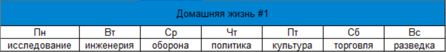

Остальные положения идут как паразитарные со совсем не свойственной домашней жизни функциями:

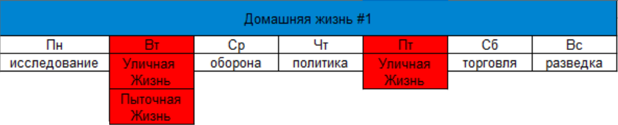

Через паразитарные положения к вам может проникнуть чужая домашняя жизнь:

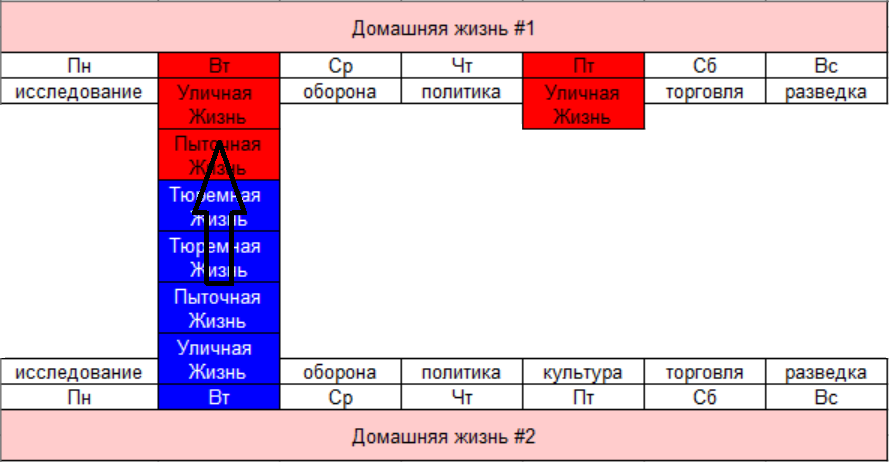

Чередуя режимы обогащения вы можете узнать где проблемные зоны у вашей домашней жизни и заякорившись на проблемной зоне совершить починку или стать частью паразитов, в случае облома.

Если нужно пройтись между положениями, то на каждом положении нужно стать хозяином с помощью таких состояний:

```
понимание - домашнее
уверенность - уличное
сожаление - пыточное
надежность - тюремное
```

Все психоделики ставят на положение улицы и полезны для вызволения из пыточной и тюрьмы, в особенности аяхуаска (отрабатывает Т♡ для мужчин) и псилоцибин (Т♢ для женщин как наполнение).

При приёме психоделиков вы катастрафически лишаетесь положения дома (если оно было), но при окупации вашего дома это хорошая помощь чтобы отбить врага до положения пыточного, возможно не только своего, но и врага.

При  каждом создании уклада будет строиться ваша натальная карта судьба (как на ладонях рук). Чтобы в дальнейшем не потеряться в большом количестве укладов и иметь представление куда вы двигаетесь - нужно ввести привязку укладов к символам домашней жизни:

```
🛏 отдых
⏰ бизнес
👫 отношения
🎮 развлечения
```

С таким подходом у вас будет такая статистика:

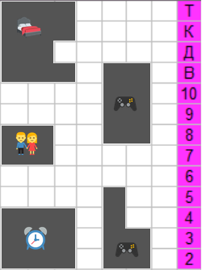

Одна клетка - один уклад. По началу рост по горизонтали будет означать разнос лжи, а по вертикали - устранение преград.

Если есть уклады одного символа которые не соединены по вертикали (на примере это 🎮 на 6-ке и 7-ке), то такой уклад не адекватен (без жизненного сроста) и нужно внести уклады по отсутствующим номиналам (отработать долг).

Со временем (качественным) ваши уклады начнут идеально (а не поперёк) вписываться в матрицу мира образовывая квадратичные скрижали дополнения.

Выглядят они так:


Если вы ещё такие уклады не делали, то первой игральной картой будет 8♤ для мужчины и 8♧ для женщины.

<hr>

### Безупречный путь

В СИЗО я использовал для работы с методикой обычную ручку и тетрадку. Вычерчивал квадрат 7х7 и с центра змейкой по часовой делал уклады с желаниями формата "желаю чтобы ...":

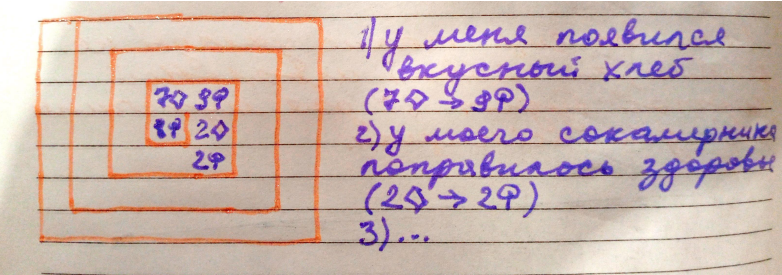

По мере заполнения фиксировал символами домашней жизни чтобы исключить долги:

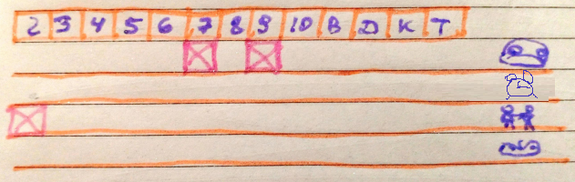

Если под конец был не срост на символах домашней жизни, то я увеличивал матрицу до 9х9 и дорабатывал.

По факту готовности матрицы я дорисовывал восьмиконечную звезду как символ постоянства, внутри по центру рисовал глаз как символ внимания, а вокруг по три линии на четырёх внешних углах как символ безмятежности:

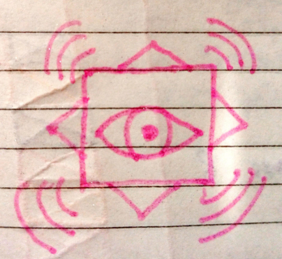

Как я когда то словил информацию - это схема устройства преодолевающее гравитацию.

На вид коробочка из золота. Когда поворачиваешь до восьмиконечной звезды по центру открывается вид на алмаз с которым можно общаться и просить всё необходимое от окружающей материи.

Если у Вас хороший город, или планируете в такой переезжать, то вот методичка "режимов обогащения по масти" по дням недели:

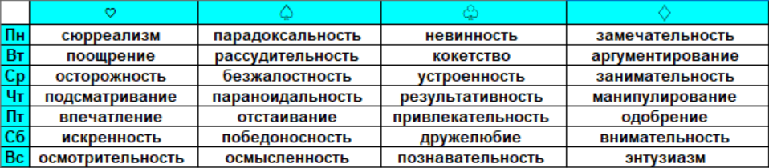

Контакт на сайте: https://wikimagia.forum2x2.ru/t710-topic


